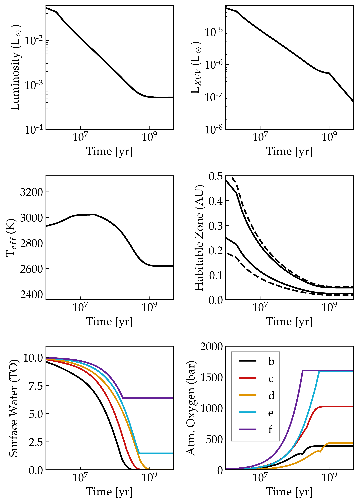

Atmospheric Escape in the TRAPPIST-1 Planetary System
============

Overview
--------

Water photolysis, hydrogen escape, and oxygen buildup on the TRAPPIST-1 planets
as predicted by `vplanet <https://github.com/VirtualPlanetaryLaboratory/vplanet>`_.

===================   ============
**Date**              12/27/18
**Author**            Rory Barnes
**Modules**           AtmEsc, STELLAR
**Approx. runtime**   20 seconds
**Source code**       `vplanet <https://github.com/VirtualPlanetaryLaboratory/vplanet>`_,
                      `vplot <https://github.com/VirtualPlanetaryLaboratory/vplot>`_
===================   ============

To run this example
-------------------

.. code-block:: bash

  vplanet vpl.in
  python makeplot.py <pdf | png>

Expected output
---------------

