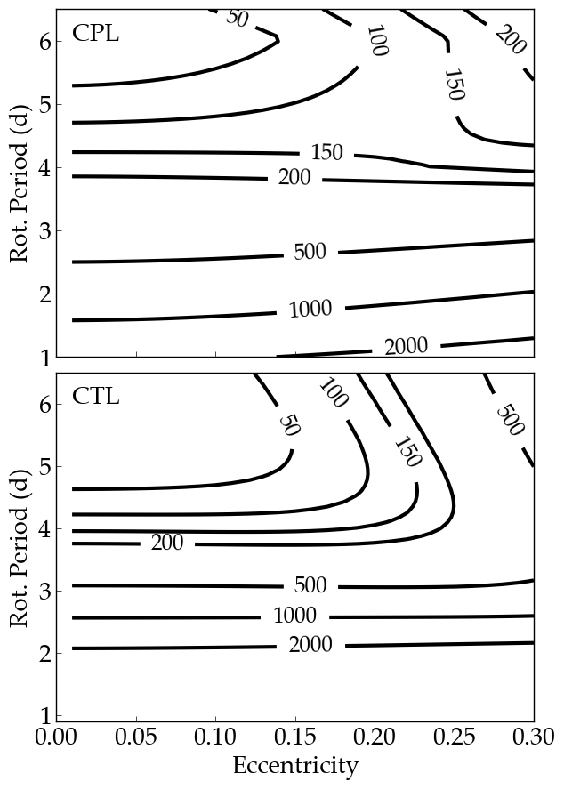

Tidal Heating of the TRAPPIST-1 e due to rotation and eccentricity
============

Overview
--------

Tidal heating of the TRAPPIST-1 e as predicted by the eqtide module in
`VPLanet <https://github.com/VirtualPlanetaryLaboratory/vplanet>`_.

===================   ============
**Date**              08/28/2020
**Author**            Rory Barnes
**Modules**           EqTide
**Approx. runtime**   100 seconds
**Source code**       `vplanet <https://github.com/VirtualPlanetaryLaboratory/vplanet>`_,
                      `vplot <https://github.com/VirtualPlanetaryLaboratory/vplot>`_,
                      `vspace`,
                      `multi-planet`
===================   ============

To run this example
-------------------

.. code-block:: bash

  cd CPL; vspace vspace.in
  multi-planet vspace.in <ncores>
  cd ../CTL; vspace vspace.in
  multi-planet vspace.in <ncores>
  python makeplot.py <pdf | png>

Here <ncores> is the number of cores to run the parameter sweep with. Note that
these commands will create directories called "data" in the CPL and CTL
subdirectories.

Expected output
---------------

Surface energy flux in W/m^2 due to tides as a function of eccentricity and
rotation period. The top panel is the CPL model with a tidal Q of 100 and the
bottom panel is the CTL model with a tidal time lag of 628 seconds. In both
cases the Love number of degree 2 is 0.3.
