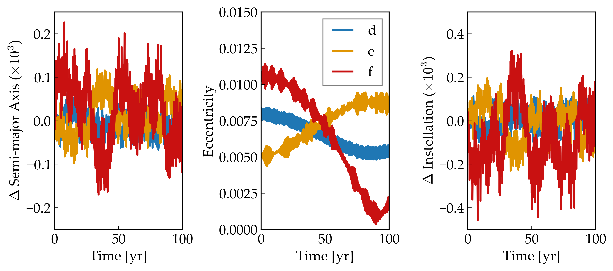

N-Body Integration of the TRAPPIST-1 Planetary System
============

Overview
--------

Orbital evolution of the TRAPPIST-1 planets
as predicted by `vplanet <https://github.com/VirtualPlanetaryLaboratory/vplanet>`_.

===================   ============
**Date**              12/20/18
**Author**            Rory Barnes
**Modules**           SpiNBody
**Approx. runtime**   75 Minutes
**Source code**       `vplanet <https://github.com/VirtualPlanetaryLaboratory/vplanet>`_,
                      `vplot <https://github.com/VirtualPlanetaryLaboratory/vplot>`_
===================   ============

To run this example
-------------------

.. code-block:: bash

  vplanet vpl.in
  python makeplot.py <pdf | png>

Expected output
---------------

Semi-major axis (left), eccentricity (middle) and instellation (right) evolution of TRAPPIST-1 d,e,f, with stellar parameters from `van Grootel et al. (2018) <https://ui.adsabs.harvard.edu//#abs/2018ApJ...853...30V/>`_ and planetary parameters from `Grimm et al. (2018) <https://ui.adsabs.harvard.edu//#abs/2018A&A...613A..68G/>`_. 
